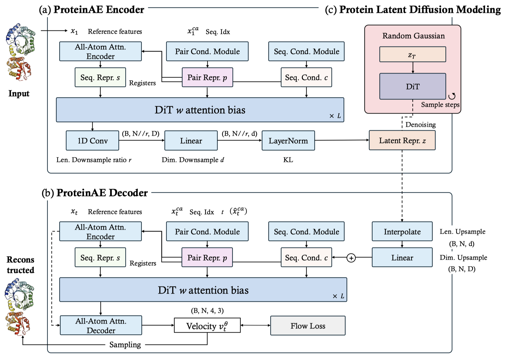

# ProteinAE: Diffusion Protein AutoEncoder for Structure Encoding

<div align="center">
<a href="https://arxiv.org/pdf/2510.10634">
  
</a>
<a href="https://github.com/NVIDIA-Digital-Bio/proteina">
  
</a>
<a href="https://github.com/lisn519010/ProteinAE_clean/blob/main/LICENSE">
  
</a>
</div>

<div align="center">
    
</div>

## Overview

ProteinAE is a diffusion-based protein autoencoder that directly mapping protein backbone coordinates from E(3) into a
continuous, compact latent space. This repository provides both the autoencoder for protein structure encoding and a latent diffusion model (PLDM) for protein generation.

<div align="center">
    
</div>

### Key Features

- **Simple and Effective Protein Diffusion Autoencoder** - Continuous all-atom protein structure representation in E(3)
- **Protein Latent Diffusion Modeling** - Protein generation in latent space

## Quick Start

### Installation

```bash
# Clone the repository
git clone https://github.com/lisn519010/ProteinAE_v1.git
cd ProteinAE_v1

# Create and activate environment
mamba env create -f environment.yaml
mamba activate proteinae

# Install the package
pip install -e .
```

## AutoEncoder

The autoencoder component encodes protein structures into a latent representation and reconstructs them back to full atomic coordinates.

### Download Checkpoints

```bash
# Create checkpoints directory
mkdir -p checkpoints

# Download ProteinAE checkpoint
wget https://hf-mirror.com/lisn519010/ProteinAE_v1/resolve/main/ae_r1_d8_v1.ckpt -O checkpoints/ae_r1_d8_v1.ckpt
```

### Inference

Run autoencoder inference on a protein structure:

```bash
input_pdb="examples/7v11.pdb"
output_dir="output"
config_path="$PWD/configs"
python proteinfoundation/autoencode.py \
    --input_pdb $input_pdb \
    --output_dir $output_dir \
    --config_path $config_path \
    --mode autoencode
```

**Input**: PDB file containing protein structure  
**Output**: Reconstructed PDB file

### Training

Train your own autoencoder model:

```bash
python proteinfoundation/train_ae.py \
    --config_name training_ae_r1_d8
```

## Latent Diffusion Model (LDM)

The LDM component generates protein structures in the latent space learned by the autoencoder.

### Training

Train the latent diffusion model:

```bash
python proteinfoundation/train_ldm.py \
    --config_name training_pldm_200M_afdb_512
```

### Inference

Generate protein structures using the trained LDM:

```bash
python proteinfoundation/inference_ldm.py \
    --config_name inference_ucond_pldm_200M_512 \
    --ckpt_name pldm_200M.ckpt
```

**Output**: Generated protein structures in PDB format

## Examples

The `examples/` directory contains sample protein structures:
- `7v11.pdb` - PDB structure example
- `AF-Q8W3K0-F1-model_v4.pdb` - AlphaFold prediction example

## Project Structure

```
ProteinAE_v1/
├── proteinfoundation/          # Main package
│   ├── autoencode.py          # Autoencoder inference
│   ├── train_ae.py            # Autoencoder training
│   ├── train_ldm.py           # LDM training
│   ├── inference_ldm.py       # LDM inference
│   └── ...
├── configs/                   # Configuration files
├── examples/                  # Sample protein structures
├── checkpoints/               # Model checkpoints
├── output/                    # Generated outputs
└── scripts/                   # Utility scripts
```

## Acknowledgments

This work is based on the [Proteina](https://github.com/NVIDIA-Digital-Bio/proteina) repository and extends the **CA-only modeling** approach to **full-backbone-atom modeling**. The modifications for full-backbone-atom modeling can be found in [this PR](https://github.com/NVIDIA-Digital-Bio/proteina/pull/15).

## Citation

If you find this work useful, please cite:

```bibtex
@article{li2025proteinae,
  title={ProteinAE: Protein Diffusion Autoencoders for Structure Encoding},
  author={Li, Shaoning and Zhuo, Le and Wang, Yusong and Li, Mingyu and He, Xinheng and Wu, Fandi and Li, Hongsheng and Heng, Pheng-Ann},
  journal={arXiv preprint arXiv:2510.10634},
  year={2025}
}
```

```bibtex
@article{geffner2025proteina,
  title={Proteina: Scaling flow-based protein structure generative models},
  author={Geffner, Tomas and Didi, Kieran and Zhang, Zuobai and Reidenbach, Danny and Cao, Zhonglin and Yim, Jason and Geiger, Mario and Dallago, Christian and Kucukbenli, Emine and Vahdat, Arash and others},
  journal={arXiv preprint arXiv:2503.00710},
  year={2025}
}
```

## License

This project is licensed under the MIT License - see the [LICENSE](LICENSE) file for details.