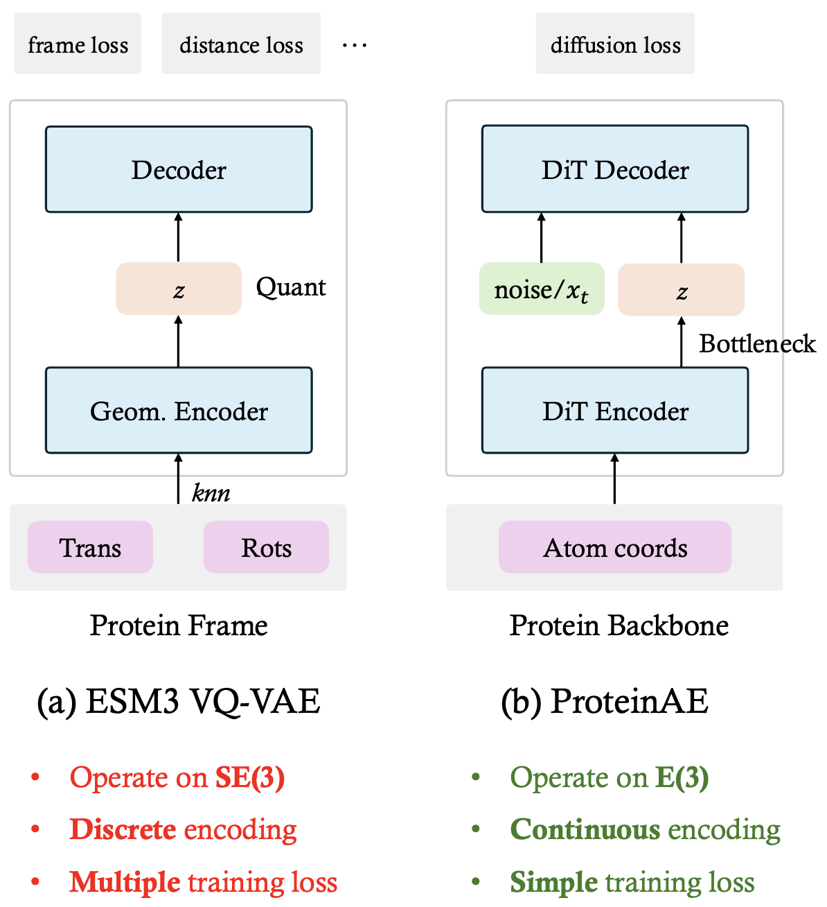

# ProteinAE: Diffusion Protein AutoEncoder for Structure Encoding

<div align="center">
<a href="https://arxiv.org/pdf/2510.10634">
  
</a>
</div>

<div align="center">
    
</div>

<br>
<br>

## Setup
```
mamba env create -f environment.yaml
mamba activate proteinae
pip install -e .
```

## AutoEncoder

### Inference

```bash
python proteinfoundation/autoencode.py \
    --input_pdb $input_pdb \
    --output_dir output \
    --config_path /path/to/configs \
    --mode autoencode
```

### Training

```bash
python proteinfoundation/train_ae.py \
    --config_name training_ae_r1_d8
```


## LDM

### Training

```bash
python proteinfoundation/train_ldm.py \
    --config_name training_pldm_200M_afdb_512
```

### Inference

```bash
python proteinfoundation/inference_ldm.py \
    --config_name inference_ucond_pldm_200M_512 \
    --ckpt_name pldm_200M.ckpt
```

### TODO List:
- [ ] Add ProteinAE checkpoint
- [ ] Add ProteinLDM checkpoint

## Acknowledgments

This work is based on the [Proteina](https://github.com/NVIDIA-Digital-Bio/proteina) repository.

## Citation

If you find this work useful, please cite:

```bibtex
@article{li2025proteinae,
  title={ProteinAE: Protein Diffusion Autoencoders for Structure Encoding},
  author={Li, Shaoning and Zhuo, Le and Wang, Yusong and Li, Mingyu and He, Xinheng and Wu, Fandi and Li, Hongsheng and Heng, Pheng-Ann},
  journal={arXiv preprint arXiv:2510.10634},
  year={2025}
}

@article{geffner2025proteina,
  title={Proteina: Scaling flow-based protein structure generative models},
  author={Geffner, Tomas and Didi, Kieran and Zhang, Zuobai and Reidenbach, Danny and Cao, Zhonglin and Yim, Jason and Geiger, Mario and Dallago, Christian and Kucukbenli, Emine and Vahdat, Arash and others},
  journal={arXiv preprint arXiv:2503.00710},
  year={2025}
}
```